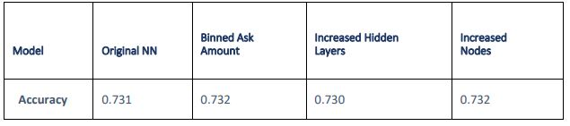

AlphabetSoupMLNN is a Neural Net machine learning model that predicts the success of a venture paid by Alphabet soup. The trained model is used to determine the future decisions of the company—only projects and how likely these ventures are to be a success. It will therefore predict which projects will receive any future funding from Alphabet Soup.

Alphabet soup is a philanthropic foundation that aims at supporting endeavors that protect the environment, improve individual well being, and unify the world. It has donated over 10B dollars for life saving technologies and reforestation groups. 
## Objectives

The objectives for this project is analyze the impact of each donation so that the foundation’s money is being used effectively. Train a deep learning net work evaluate all types of input data and predict a clear decision result. The NN needs to predict which donations are worth donating to and which are too high risk

* Import, analyze, clean, and preprocess a “real-world” classification dataset.
* Select, design, and train a binary classification model of your choosing.
* Optimize model training and input data to achieve desired model performance.

## Technologies Used:
* Python
* Tensorflow
* Pandas
* Sklearn
* Jupyter Notebook
* Os

## Analysis
A deep-learning neural network model was trained and evaluated on Alphabet Soup Foundation records 
to use the features of applications to predict how effectively funding will be spent.
This classifier could be used by the Alphabet Soup Foundation to preemptively identify successful 
investments based on basic characteristics of the funding application. In the long run, this model could 
improve the charity’s impact by channeling their funds towards valuable projects.
Results
Data Preprocessing
The features used to build the model are as follows:
1. Application Type
2. Classification
3. Use Case
4. Organization
5. Status
6. Income Amount
7. Special Considerations
8. Ask Amount
Identifiers (EIN and Applicant Name) were removed from the data set prior to model building. The target 
variable for the model is “Success”, a predetermined binary variable encoding whether Alphabet Soup 
believes their funding to the applicant was used effectively.
Compiling, Training, and Evaluating the Model
An initial neural network model was compiled with 3 hidden layers, composed of 10, 8, and 6 nodes, 
respectively, with a RelU activation function. Based on computational restraints and the decent sample 
size obtained from the Alphabet Soup records (over 34,000), this simple deep learning model was a 
reasonable place to start. Target performance was 75% accuracy. The original neural network achieved 
an accuracy of 73.1%.
Optimization of the Model
It was observed that almost 90% of applications in this dataset asked for exactly $5000. However, 
amounts applied for include sums as high as $8.5B. This extreme skew could be impacting or confusing 
the model. To alleviate the skew, this numerical variable was binned into amounts equal to $5000, 
between $5000-10K, and greater than $10K. This did not have a meaningful impact on the accuracy of 
the model (0.732). Overfitting did not appear to be an issue with the original model – accuracy on the 
training set was comparable to accuracy on the test data. Thus, it is reasonable to expand the structure 
of the neural network to improve accuracy. This was accomplished in two more optimization steps.
1. First, an additional layer with 4 nodes was added to the original model. This did not significantly 
improve the model’s accuracy (0.731).
2. Second, all four layers were given 10 nodes. This also did not significantly improve the model’s 
accuracy (0.732).

###Summary
After three rounds of optimizing the deep-learning neural network model, we were unable to meet the 
75% accuracy performance target. You can see the summary of obtained accuracy for each model 
below.

We recommend exploring other modeling techniques to develop a classifier for this data. As the 
application features are already relatively few in this dataset, feature selection techniques (PCA, t-SNE, 
Lasso) could be explored but may still have accuracy less than 75%.
